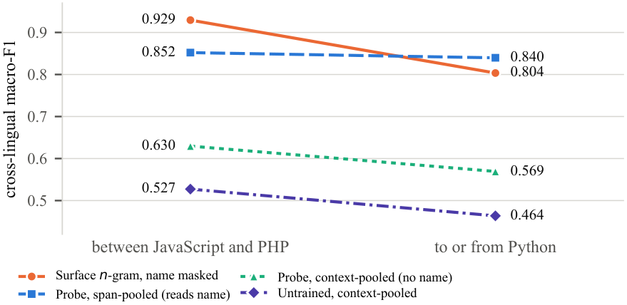

# Code Model Interpretability

Official repository for two NeurIPS 2026 workshop papers on what a linear probe score can and cannot claim about code models.

<p align="center">
  <a href="paper/interp_science_short/main.pdf"><b>Same Score, Different Evidence: Decodability, Surface Sufficiency, and Causal Relevance in Code Models</b></a>
  <br>
  <em>Interpretability as a Science</em>
</p>

<p align="center">
  <a href="paper/lp4fm_short/main.pdf"><b>Cross-Language Probe Invariance Depends on Readout Choice</b></a><br>
  <em>Linguistic Principles for Foundation Models (LP4FM)</em>
</p>

<p align="center">
  <a href="https://huggingface.co/datasets/dhyuti-n/xlcost-variable-roles">Dataset</a> ·
  <a href="https://colab.research.google.com/github/nolanlwin/code-model-interpretability/blob/main/notebooks/colab_results.ipynb">Colab</a> ·
  <a href="LICENSE">License</a>
</p>

<p align="center">
  
</p>
<p align="center">
  <em>The same transfer task supports opposite conclusions once the readout stops reading the identifier name. Figure from the LP4FM paper.</em>
</p>

A high probe score establishes decodability under a particular readout. It does not establish that the feature is absent from surface form, that a renaming intervention tested semantics rather than leaking the label, or that the model uses the feature at a tested site. This repository records those distinctions on variable-role probes over XLCoST code models.

## Papers

### Same Score, Different Evidence

[Manuscript (PDF)](paper/interp_science_short/main.pdf) · Interpretability as a Science, NeurIPS 2026

Three cases report probe scores near 0.98 and license three different conclusions.

| Case | Probe macro-F1 | What the comparison actually supports |
|---|---|---|
| Boolean occurrence type | 0.981–0.988 | A name-masked source-line classifier reaches 0.983 without a language model. Paired deltas exclude a probe advantage above 0.017 on Python. |
| Iterator role | 0.976–0.987 | Role-conditioned renaming reaches 0.998–0.999 at embedding layer zero. The intervention encodes a lexical shortcut. |
| Class or structure site | 0.979–0.982 | A full-residual patch recovers 0.009–0.020 of the matched behavioral gap at one site and layer. That is a bounded site-state effect, not global non-use. |

The study covers three models and five identifier targets, collectively across all seven XLCoST languages, without a complete factorial design. The paper binds each claim to an estimand, comparator, matching unit, uncertainty statement, outcome, and falsifier.

### Cross-Language Probe Invariance Depends on Readout Choice

[Manuscript (PDF)](paper/lp4fm_short/main.pdf) · LP4FM, NeurIPS 2026

A span-pooled residual probe looks language-invariant on parallel Python, JavaScript, and PHP solutions. A name-masked character *n*-gram classifier does not. Excluding the occurrence from the probe readout reverses the trained boundary relative to the surface classifier, and untrained networks show a comparable or steeper trained boundary depending on the model. The original invariance is not identified independently of the readout.

## Setup

Python ≥ 3.11. GPU is recommended for probing. Dataset construction is CPU-only.

```bash
python3 -m venv .venv
source .venv/bin/activate
pip install -r pipeline/requirements.txt
```

The root `requirements.txt` is the upstream XLCoST environment for the original notebooks. The pipeline does not need it.

## Data

**Published dataset** (no XLCoST download required):

```python
from datasets import load_dataset

perturb = load_dataset("dhyuti-n/xlcost-variable-roles", "python_perturbations")
multi   = load_dataset("dhyuti-n/xlcost-variable-roles", "multilingual_baseline")
```

```bash
hf download dhyuti-n/xlcost-variable-roles --repo-type dataset --local-dir data/dataset
```

**Rebuild from XLCoST.** Unzip `XLCoST_data.zip` into the repository root, or set `XLCOST_ROOT`, then:

```bash
python -m pipeline.build_dataset --out data/dataset
python -m pipeline.build_dataset --out data/dataset --max-programs 500
```

Labels come from AST and regular-expression extractors, never from the identifier name. The five roles are `index_key`, `accumulator`, `iterator`, `boolean`, and `class_struct`. Field definitions and XLCoST credits are in [`data/dataset/README.md`](data/dataset/README.md). Patching inputs live in `data/patching/`.

## Experiments

```bash
# perturbation sweep for one role (Python, all naming strategies)
python -m pipeline.run_experiment perturbation --role accumulator \
    --model Qwen/Qwen2.5-1.5B --split train --max-programs 500

# cross-language transfer for one role (Python-trained probe to six languages)
python -m pipeline.run_experiment crosslang --role index_key \
    --model Qwen/Qwen2.5-1.5B --split train --max-programs 300
```

Sweep every role:

```bash
for role in index_key accumulator iterator boolean class_struct; do
  python -m pipeline.run_experiment perturbation --role $role --max-programs 500
  python -m pipeline.run_experiment crosslang    --role $role --max-programs 300
done
```

Outputs land in `results/unified/<model>/<role>/<mode>/` (`per_layer.csv`, `summary.csv`, `cosine_vs_baseline.csv`, `crosslang.csv`).

Protocol: per-layer logistic regression on standardized frozen hidden states, problem-hash 70/10/20 splits, layer selected on the validation fold, five seeds, macro-F1 with program-clustered BCa intervals, a random-label control task, and a tokenizer-offset gate before extraction. Any Hugging Face causal model works via `--model`.

The manuscript-grade boolean, renaming, and causal path lives in `scripts/`:

```bash
bash scripts/run_language.sh Python Qwen/Qwen2.5-Coder-1.5B train
bash scripts/run_renaming.sh Python Qwen/Qwen2.5-Coder-1.5B train
```

Resumable Colab entry point: [`notebooks/colab_results.ipynb`](https://colab.research.google.com/github/nolanlwin/code-model-interpretability/blob/main/notebooks/colab_results.ipynb). Set `LANGUAGE` in cell 2. Checkpoints write to Drive after each model.

## Citation

The submissions are anonymous. Please cite the manuscripts as:

```bibtex
@inproceedings{anonymous2026samescore,
  title     = {Same Score, Different Evidence: Decodability, Surface Sufficiency, and Causal Relevance in Code Models},
  author    = {Anonymous},
  booktitle = {Workshop on Interpretability as a Science at NeurIPS},
  year      = {2026},
  note      = {Under review}
}

@inproceedings{anonymous2026readout,
  title     = {Cross-Language Probe Invariance Depends on Readout Choice},
  author    = {Anonymous},
  booktitle = {Workshop on Linguistic Principles for Foundation Models at NeurIPS},
  year      = {2026},
  note      = {Under review}
}
```

## License

Code in this repository is released under the [Apache License 2.0](LICENSE).

Source programs come from [XLCoST](https://github.com/reddy-lab-code-research/XLCoST) (Zhu et al., 2022, [arXiv:2206.08474](https://arxiv.org/abs/2206.08474), Apache-2.0). This repository adds structural role labels, renaming perturbations, probes, and the reporting artifacts used in the two papers.
